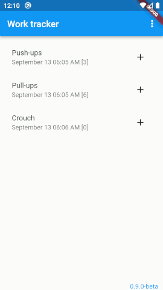
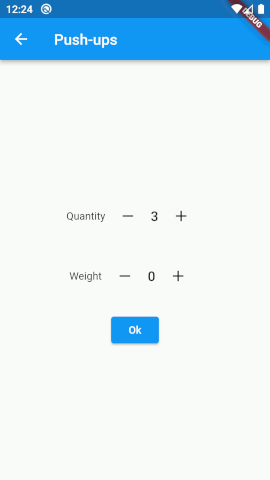
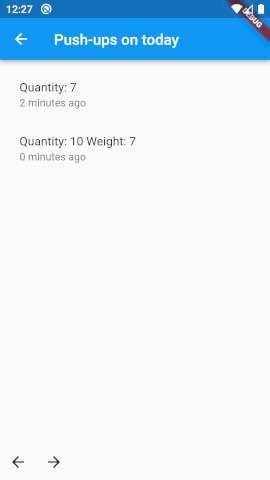
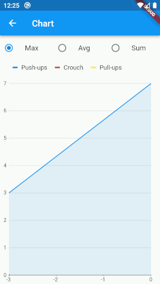

# work_tracker

My pet project to track street workouts results.

## Features
* stores log of exercises.
  Data stored: kind, quantity, additional weight (optional), date and time.
* shows graph for recent six month.
* additional weight can be used as quantity multiplication coeficient according to the body weight value.
* excercise type can be added, renamed or removed.
  Excercise type name is in English by default and is not localizable (however it may be adjusted manually)

Android 6 (API level 23) has 
[Doze](https://developer.android.com/training/monitoring-device-state/doze-standby)
 power saving mode implemented.
This prevents apps to set alarm `more than once per 9 minutes, per app.` as documented.

This may be a problem if exercises are short and pauses between exercises are less than 9 minutes.

This may be resolved by turning a battery optimization off (`Settings - Battery`) however this may cause a battery drain.

### Usage
I've found that there is a way to get notifications each five minutes between exercises.

I add new result and leave an application running foreground. 
Then I lock screen and put the phone to a pocket.

This makes notifications running each five minutes e.g.

However the notification is not raised in time when I minimize the application and lock the screen.

#### How it looks like

The application interface is pretty simple.
It has main screen, new item screen, settings and charts pages.

Main screen has the list of exercise kinds and latest data per exercise.



New exersice results is registered when **+** button is pressed.
Quantity and additional weight (if any) should be specified here.



The exercise history is available by single click on the row.
You can browse the exercise history by day using _Back_ and _Forward_ buttons in the left bottom corner.



The chart page is available by context menu (three dots in the upper right part of the screen)




## Programming

### Data storage

Stores workout log data using Flutter [Hive Db](https://docs.hivedb.dev/#/) 

#### old structure
I've to modify the generated Hive adapters source code in order to support old database structure.

My first attempt was to check how many fields have a data record and to read from data source if there are column for the current row. 
Like  `if (numOfFields > 3) value = data[3]`

Then I changed it like `value = data[3] == null ? 0 : data[3] as int`

### Notification
Uses the 
[AndroidAlarmManager](https://pub.dev/packages/android_alarm_manager_plus)
to create a next exercise notification.
However callbacks are executed in the alarm manager isolation. 
I've used 
[SharedPreferences](https://pub.dev/packages/shared_preferences)
 to save the notification configuration by the app and to load the config by the callback method.
 The notification config instance is serialized as Json string and stored as shared preference value.

The [ringtone player](https://pub.dev/packages/flutter_ringtone_player) 
produces notification sound.

### Localization

`en` and `uk` localizations are supported.

Commands below should re-generate `app_localizations.dart` source code.

```bash
flutter gen-l10n --template-arb-file=app_en.arb
```

where `app_en.arb` is the resource file name.

